# Final Database Diagram

This diagram reflects the expanded model currently represented in the SQL scripts under `src/sql/`.

```mermaid
erDiagram
  ROLES ||--o{ USER_ROLES : grants
  USERS ||--o{ USER_ROLES : receives

  BRANDS ||--o{ USERS : defaults
  DEPARTMENTS ||--o{ USERS : defaults
  LOCATIONS ||--o{ USERS : defaults

  BRANDS ||--o{ BRAND_LOCATIONS : maps
  LOCATIONS ||--o{ BRAND_LOCATIONS : maps

  BRANDS ||--o{ SOPS : scopes
  DEPARTMENTS ||--o{ SOPS : scopes
  LOCATIONS ||--o{ SOPS : scopes
  USERS ||--o{ SOPS : owns
  USERS ||--o{ SOPS : submits
  USERS ||--o{ SOPS : approves

  SOPS ||--o{ SOP_ASSIGNMENTS : creates
  BRANDS ||--o{ SOP_ASSIGNMENTS : scopes
  DEPARTMENTS ||--o{ SOP_ASSIGNMENTS : scopes
  LOCATIONS ||--o{ SOP_ASSIGNMENTS : scopes
  USERS ||--o{ SOP_ASSIGNMENTS : owns
  USERS ||--o{ SOP_ASSIGNMENTS : verifies

  CHECKLIST_TEMPLATES ||--o{ CHECKLIST_ITEMS : contains
  CHECKLIST_TEMPLATES ||--o{ AUDITS : used_by
  BRANDS ||--o{ AUDITS : scopes
  DEPARTMENTS ||--o{ AUDITS : scopes
  LOCATIONS ||--o{ AUDITS : scopes
  USERS ||--o{ AUDITS : performs
  AUDITS ||--o{ AUDIT_RESPONSES : records
  CHECKLIST_ITEMS ||--o{ AUDIT_RESPONSES : answered_by

  BRANDS ||--o{ CORRECTIVE_ACTIONS : scopes
  DEPARTMENTS ||--o{ CORRECTIVE_ACTIONS : scopes
  LOCATIONS ||--o{ CORRECTIVE_ACTIONS : scopes
  USERS ||--o{ CORRECTIVE_ACTIONS : assigned
  USERS ||--o{ CORRECTIVE_ACTIONS : submits
  USERS ||--o{ CORRECTIVE_ACTIONS : verifies

  BRANDS ||--o{ KPI_DEFINITIONS : scopes
  DEPARTMENTS ||--o{ KPI_DEFINITIONS : scopes
  LOCATIONS ||--o{ KPI_DEFINITIONS : scopes
  USERS ||--o{ KPI_DEFINITIONS : owns
  KPI_DEFINITIONS ||--o{ KPI_RESULTS : records
  BRANDS ||--o{ KPI_RESULTS : scopes
  DEPARTMENTS ||--o{ KPI_RESULTS : scopes
  LOCATIONS ||--o{ KPI_RESULTS : scopes

  ROLES ||--o{ FILE_ACCESS_RULES : secures
  USERS ||--o{ FILE_ACCESS_RULES : secures
  BRANDS ||--o{ FILE_ACCESS_RULES : secures
  DEPARTMENTS ||--o{ FILE_ACCESS_RULES : secures
  LOCATIONS ||--o{ FILE_ACCESS_RULES : secures

  SOPS ||--o{ AUDIT_LOG : traces
  SOP_ASSIGNMENTS ||--o{ AUDIT_LOG : traces
  AUDITS ||--o{ AUDIT_LOG : traces
  CORRECTIVE_ACTIONS ||--o{ AUDIT_LOG : traces
  KPI_RESULTS ||--o{ AUDIT_LOG : traces

  SOPS ||--o{ EVIDENCE_FILES : attaches
  SOP_ASSIGNMENTS ||--o{ EVIDENCE_FILES : attaches
  AUDITS ||--o{ EVIDENCE_FILES : attaches
  CORRECTIVE_ACTIONS ||--o{ EVIDENCE_FILES : attaches
  KPI_RESULTS ||--o{ EVIDENCE_FILES : attaches
```

## Notes
- `EVIDENCE_FILES` and `AUDIT_LOG` are polymorphic by `ENTITY_TYPE` and `ENTITY_ID`, so the relationships above are logical, not enforced by Snowflake foreign keys.
- `FILE_ACCESS_RULES` is also polymorphic and is designed for app-enforced SharePoint document access.
- Scope can be at `brand`, `brand + department`, `brand + location`, or `brand + department + location` depending on which columns are populated.
