# Project Blueprint

This is the simple visual blueprint of the Swish Compliance system: vision, targets, completed foundation, and remaining delivery flow.

```mermaid
flowchart TD
    A[Project Vision\nCentral compliance platform for Swish] --> B[Core Targets]
    B --> B1[SOP governance]
    B --> B2[Approval visibility]
    B --> B3[Implementation tracking]
    B --> B4[Audit and CAPA]
    B --> B5[Evidence and document security]
    B --> B6[KPI and dashboard reporting]

    A --> C[Scope Model]
    C --> C1[Brand]
    C --> C2[Brand + Department]
    C --> C3[Brand + Location]
    C --> C4[Brand + Department + Location]

    A --> D[Completed So Far]
    D --> D1[Base schema created]
    D --> D2[Location extension created]
    D --> D3[Views created]
    D --> D4[Seed scripts prepared]
    D --> D5[App shell created]
    D --> D6[SOP backend slice aligned]
    D --> D7[Admin master module scaffolded]
    D --> D8[Document security model added]

    A --> E[Next Delivery Flow]
    E --> E1[Configure local env and Microsoft app access]
    E --> E2[Connect app to Snowflake]
    E --> E3[Build admin CRUD]
    E --> E4[Build SOP register UI]
    E --> E5[Add approval actions]
    E --> E6[Add SharePoint file flow]
    E --> E7[Build assignments]
    E --> E8[Build audits and CAPA]
    E --> E9[Build KPI dashboard]
    E --> E10[Finalize RBAC and document access]

    A --> F[Success Outcome]
    F --> F1[Single internal compliance system]
    F --> F2[Clear accountability]
    F --> F3[Secure document access]
    F --> F4[Management visibility]
```

## Current status
- Database foundation: done
- Expanded scope model: done
- App foundation: done
- Admin master module scaffold: done
- Full workflow UI: not done yet
- Auth integration: not done yet
- SharePoint integration: not done yet
- Production-ready RBAC: not done yet
