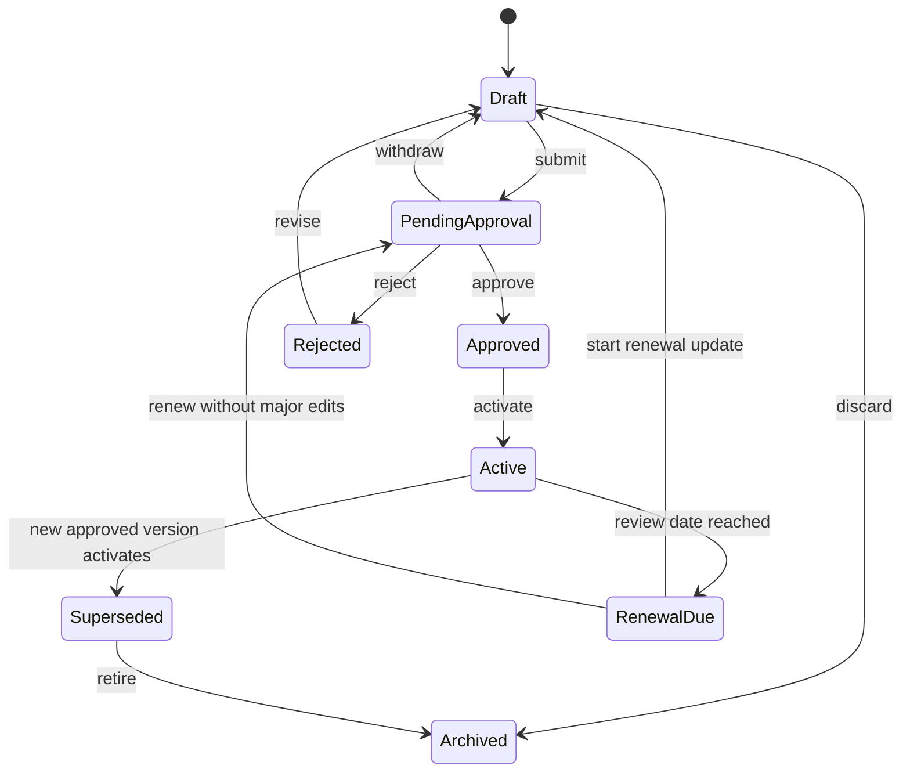
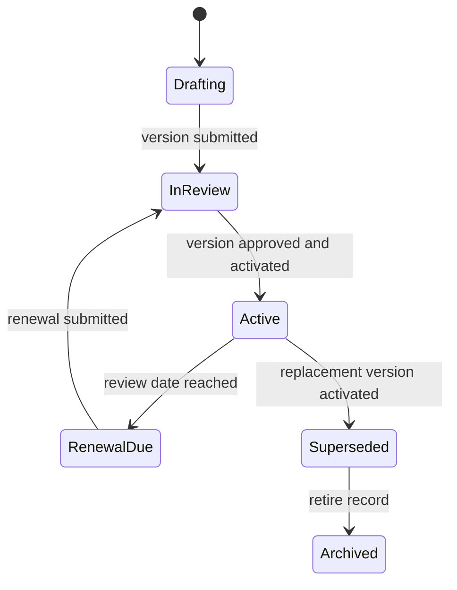
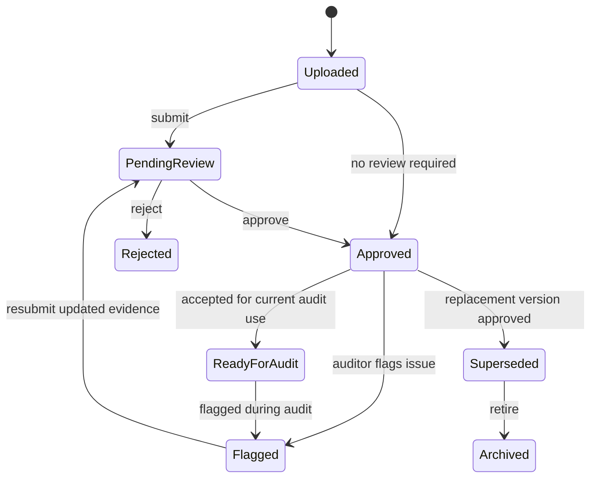
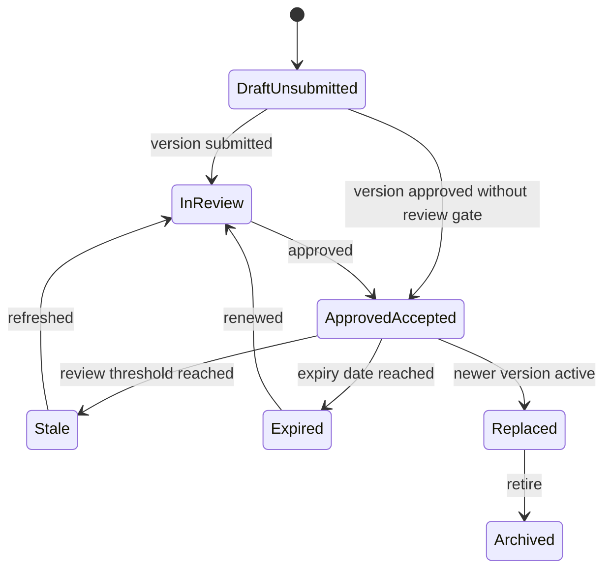
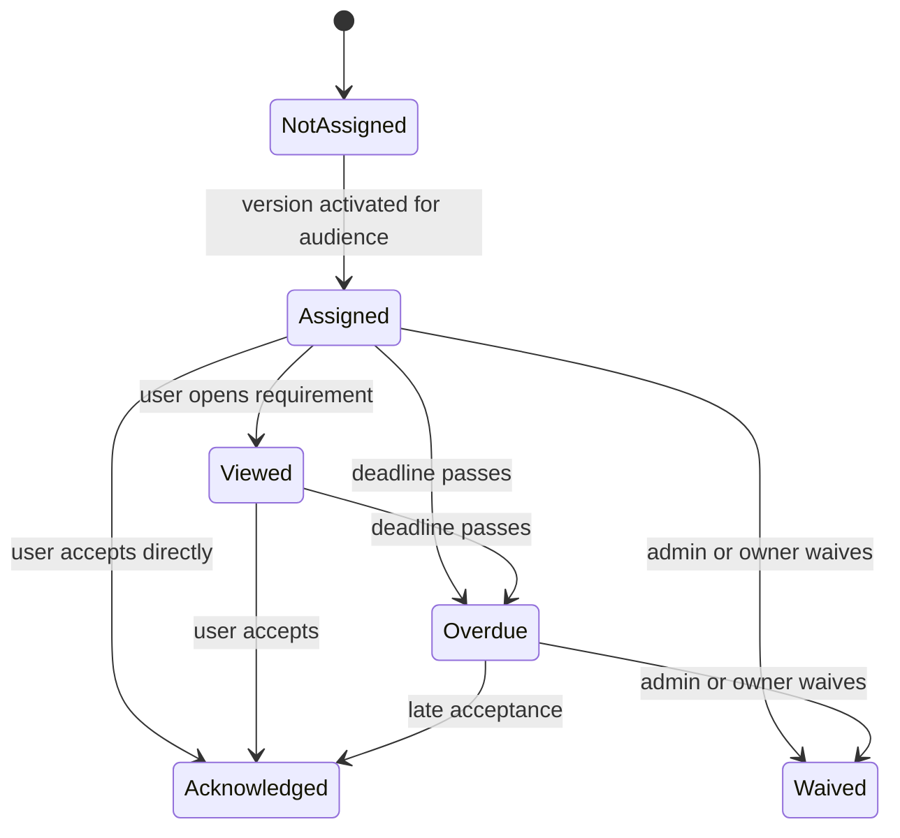
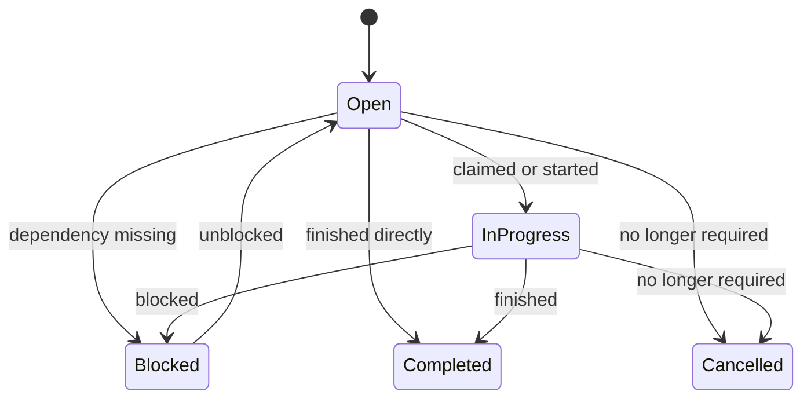
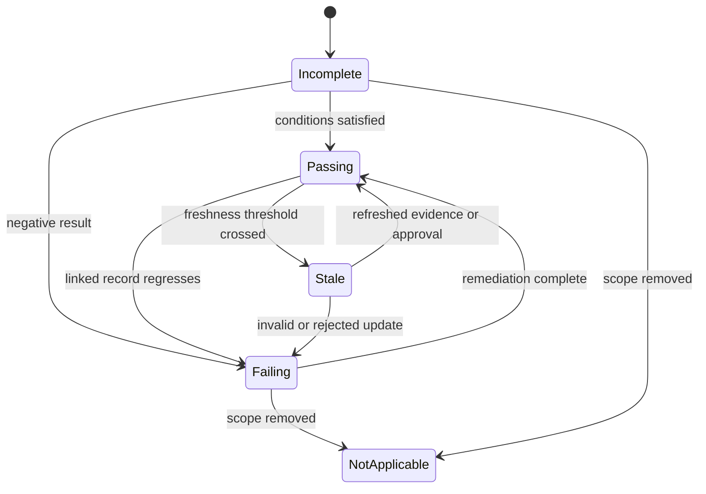
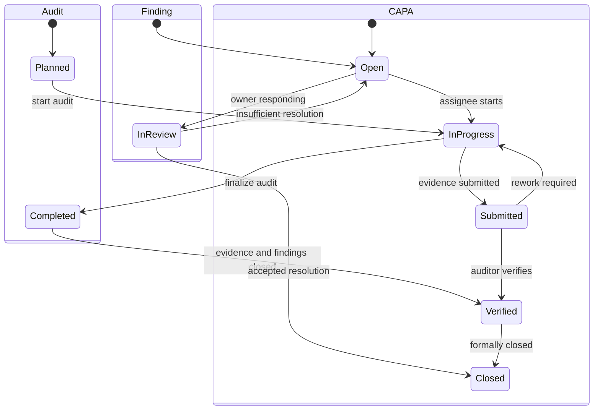

# SWiSH Phase 1 Entity And State Diagram

## Purpose

This document translates the Phase 1 PRD into a concrete domain model and workflow state model.

It is intended to answer two implementation questions:

1. what are the core shared objects for Phase 1
2. what states do those objects move through

This is the structural baseline for database design, service boundaries, and workflow implementation.

## 1. Core Phase 1 Entity Model

```mermaid
erDiagram
  BRANDS ||--o{ SITES : operates
  BRANDS ||--o{ DEPARTMENTS : contains

  USERS ||--o{ USER_ROLES : has
  ROLES ||--o{ USER_ROLES : grants

  PROGRAMS ||--o{ PROGRAM_SCOPES : scopes
  BRANDS ||--o{ PROGRAM_SCOPES : applies_to
  SITES ||--o{ PROGRAM_SCOPES : applies_to
  DEPARTMENTS ||--o{ PROGRAM_SCOPES : applies_to

  PROGRAMS ||--o{ PROGRAM_PHASES : contains
  PROGRAMS ||--o{ CONTROL_MAPPINGS : requires
  CONTROLS ||--o{ CONTROL_MAPPINGS : included_in

  CONTROLS ||--o{ CHECKS : defines
  CONTROLS ||--o{ POLICY_CONTROL_LINKS : supported_by
  POLICIES ||--o{ POLICY_CONTROL_LINKS : maps_to

  CONTROLS ||--o{ DOCUMENT_LINKS : supported_by
  DOCUMENTS ||--o{ DOCUMENT_LINKS : maps_to

  POLICIES ||--o{ POLICY_VERSIONS : versions
  USERS ||--o{ POLICIES : owns
  USERS ||--o{ POLICY_VERSIONS : authors

  POLICY_VERSIONS ||--o{ POLICY_APPROVALS : approval_steps
  USERS ||--o{ POLICY_APPROVALS : approves

  POLICIES ||--o{ POLICY_AUDIENCE_RULES : targets
  POLICY_VERSIONS ||--o{ POLICY_ACKNOWLEDGMENTS : requires
  USERS ||--o{ POLICY_ACKNOWLEDGMENTS : receives

  DOCUMENTS ||--o{ DOCUMENT_VERSIONS : versions
  USERS ||--o{ DOCUMENTS : owns
  USERS ||--o{ DOCUMENT_VERSIONS : uploads

  DOCUMENT_VERSIONS ||--o{ DOCUMENT_APPROVALS : approval_steps
  USERS ||--o{ DOCUMENT_APPROVALS : reviews

  CHECKS ||--o{ CHECK_RESULTS : evaluates
  PROGRAMS ||--o{ CHECK_RESULTS : rolls_up_from
  SITES ||--o{ CHECK_RESULTS : scoped_to

  AUDITS ||--o{ AUDIT_REQUESTS : requests
  AUDITS ||--o{ FINDINGS : creates
  USERS ||--o{ AUDITS : performs
  PROGRAMS ||--o{ AUDITS : belongs_to
  BRANDS ||--o{ AUDITS : scopes
  SITES ||--o{ AUDITS : scopes
  DEPARTMENTS ||--o{ AUDITS : scopes

  FINDINGS ||--o{ CAPA_ACTIONS : creates
  USERS ||--o{ CAPA_ACTIONS : assigned_to
  CONTROLS ||--o{ FINDINGS : impacts

  TASKS ||--o{ TASK_ASSIGNMENTS : assigns
  USERS ||--o{ TASK_ASSIGNMENTS : receives
  PROGRAMS ||--o{ TASKS : generates
  POLICIES ||--o{ TASKS : generates
  DOCUMENTS ||--o{ TASKS : generates
  CHECKS ||--o{ TASKS : generates
  AUDITS ||--o{ TASKS : generates
  FINDINGS ||--o{ TASKS : generates
  CAPA_ACTIONS ||--o{ TASKS : generates

  POLICIES ||--o{ ACTIVITY_EVENTS : traces
  POLICY_VERSIONS ||--o{ ACTIVITY_EVENTS : traces
  DOCUMENTS ||--o{ ACTIVITY_EVENTS : traces
  DOCUMENT_VERSIONS ||--o{ ACTIVITY_EVENTS : traces
  AUDITS ||--o{ ACTIVITY_EVENTS : traces
  FINDINGS ||--o{ ACTIVITY_EVENTS : traces
  CAPA_ACTIONS ||--o{ ACTIVITY_EVENTS : traces
  TASKS ||--o{ ACTIVITY_EVENTS : traces

  POLICIES ||--o{ COMMENTS : discusses
  DOCUMENTS ||--o{ COMMENTS : discusses
  AUDITS ||--o{ COMMENTS : discusses
  FINDINGS ||--o{ COMMENTS : discusses
```

## 2. Entity Responsibilities

### Program Layer

- `PROGRAMS`: internal compliance initiatives or operating standards
- `PROGRAM_SCOPES`: brand, site, and department applicability
- `PROGRAM_PHASES`: milestone structure for Program Plan

### Control And Validation Layer

- `CONTROLS`: reusable operational compliance rules
- `CONTROL_MAPPINGS`: bridges programs to controls
- `CHECKS`: reusable validations connected to controls
- `CHECK_RESULTS`: scoped evaluation outputs used for rollups

### Policy And SOP Layer

- `POLICIES`: parent governance record
- `POLICY_VERSIONS`: immutable content and metadata versions
- `POLICY_APPROVALS`: approval steps and decisions
- `POLICY_AUDIENCE_RULES`: scoped targeting rules
- `POLICY_ACKNOWLEDGMENTS`: per-user per-version acceptance evidence
- `POLICY_CONTROL_LINKS`: many-to-many support mapping from policy to controls

### Evidence Layer

- `DOCUMENTS`: parent evidence record
- `DOCUMENT_VERSIONS`: file/content versions
- `DOCUMENT_APPROVALS`: review and approval history
- `DOCUMENT_LINKS`: links from evidence to controls and other consumers

### Audit And Remediation Layer

- `AUDITS`: scoped review event
- `AUDIT_REQUESTS`: requested evidence or review items
- `FINDINGS`: nonconformities or gaps discovered in audits
- `CAPA_ACTIONS`: corrective/preventive actions raised from findings

### Work And Traceability Layer

- `TASKS`: generic workflow work items
- `TASK_ASSIGNMENTS`: user assignment records
- `ACTIVITY_EVENTS`: immutable workflow and audit trail
- `COMMENTS`: collaboration notes where needed

## 3. Shared Design Rules

- parent records hold identity and stable metadata
- version records hold mutable content snapshots
- controls connect governance, evidence, checks, audits, and remediation
- tasks are generated from state transitions rather than entered manually when possible
- rollups are computed from `CHECK_RESULTS`, `TASKS`, `ACKNOWLEDGMENTS`, `FINDINGS`, and `CAPA_ACTIONS`

## 4. Policy Version State Machine

## 5. Policy Parent Record State Machine

## 6. Document Version State Machine

## 7. Document Parent Record State Machine

## 8. Acknowledgment State Machine

## 9. Task State Machine

## 10. Check Result State Machine

## 11. Audit / Finding / CAPA Flow States

## 12. Current App Mapping

The current application already partially covers this model through:

- `SOPS`
- `SOP_ASSIGNMENTS`
- `AUDITS`
- `AUDIT_RESPONSES`
- `CORRECTIVE_ACTIONS`
- `EVIDENCE_FILES`
- `AUDIT_LOG`

The main Phase 1 gaps against the target model are:

- no parent/version split for policies or SOPs
- no structured approval-step entities
- no acknowledgment model
- no explicit controls layer as the shared hub
- no reusable checks model
- no shared task engine for Action Center and Program Plan
- no first-class program and program-phase model
- no document parent/version/review model separate from generic evidence files

## 13. Recommended Build Sequence From This Diagram

1. implement `programs`, `program_scopes`, and `program_phases`
2. implement `controls` and `control_mappings`
3. split `SOPS` into parent/active version behavior or introduce `policy_versions`
4. add `policy_approvals`, `policy_audience_rules`, and `policy_acknowledgments`
5. add document parent/version/review entities
6. add `checks` and `check_results`
7. add generic `tasks` and `task_assignments`
8. extend audits to request and track evidence against controls and versions
9. connect findings and CAPA back to controls and checks
10. build computed rollups over the shared model

## 14. Diagram Interpretation

If reduced to one implementation rule, it is this:

build Phase 1 around shared objects and explicit state machines, not around isolated pages.

That gives SWiSH the right foundation for later additions such as KPI review, broader validations, and a future SWiSH Agent without having to redesign the workflow model.