# Swish Compliance System Blueprint

This blueprint shows the target operating flow for the compliance system MVP and the next enterprise-ready layers. It is designed for management review and explains the movement of data, approvals, notifications, and reporting.

```mermaid
flowchart LR
    A[Business Excellence User<br/>Create SOP / Policy / Procedure] --> B[Next.js Web App<br/>Form validation and server action]
    B --> C[Snowflake<br/>Save SOP as Draft]
    C --> D{Submit for approval?}
    D -->|Yes| E[Workflow transition<br/>Submitted status + timestamp]
    E --> F[Outlook email trigger<br/>Notify approver]
    F --> G[Manager review panel<br/>Approve or Reject]
    G -->|Reject| H[Rejected status<br/>Remarks saved to DB]
    H --> A
    G -->|Approve| I[Approved status<br/>Approval metadata saved]
    I --> J[Activate SOP]
    J --> K[Assign to brand / department / location]
    K --> L[Teams implement SOP<br/>Upload evidence]
    L --> M[Audit execution<br/>Checklist and score]
    M --> N{Gap found?}
    N -->|Yes| O[Corrective action created]
    O --> P[Reminder / escalation email]
    P --> Q[Closure and verification]
    N -->|No| R[Compliant result]
    Q --> S[Snowflake reporting views]
    R --> S
    S --> T[Dashboard and manager reporting]
    U[SharePoint document library<br/>Controlled files and evidence] --> B
    U --> L
```

## Flow Summary

1. Business Excellence creates the SOP in the app.
2. The app validates the data and stores the draft in Snowflake.
3. Submission triggers workflow metadata updates and an approval email.
4. The approver reviews, approves, or rejects the SOP.
5. Approved SOPs become active and are assigned for implementation.
6. Teams upload evidence and auditors verify implementation.
7. Gaps create corrective actions and follow-up reminders.
8. Snowflake views drive dashboards and management reporting.

## Core System Interactions

- Web app: user interface, forms, approvals, and dashboard.
- Server actions and services: business rules, validation, and workflow transitions.
- Snowflake: source of truth for master data, SOPs, audits, CAPA, KPI data, and reporting views.
- Outlook: email triggers for submission, approval, reminders, and escalations.
- SharePoint: document and evidence storage, to be activated after IT provides credentials.